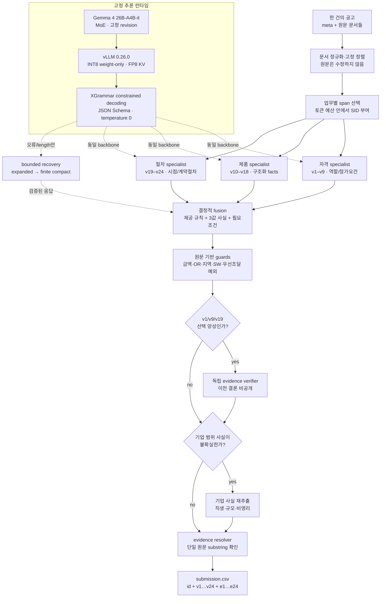

# PPS Sentinel

**Evidence-grounded neuro-symbolic monitoring for Korean public procurement notices**

나라장터 자체입찰 공고에서 24개 법령 위반 가능성을 판정하는 [DACON 236754](https://dacon.io/competitions/official/236754/overview/description)용 추론 파이프라인입니다. 고정된 `google/gemma-4-26B-A4B-it`을 공고별 구조화 사실 추출기로 사용하고, 제공된 항목표·법령·경쟁제품 목록에서 작성한 결정 규칙과 원문 근거 검증기로 최종 49열 CSV를 만듭니다.

이 저장소는 **추가 학습 없이** 실행한 최신 `sentinel` 제출 코드의 공개용 정리본입니다. `submission/`의 33개 파일은 `submission_sentinel.zip`(SHA-256 `9aad773e648a521aa4ae2e52680ff2c847b27040c231f17f16984e99f4c84922`)과 바이트 단위로 같습니다. 원본 대회 데이터, 모델 가중치, dev 예시·라벨, 예측 결과, API 키는 포함하지 않습니다.

> 사용자 확인 리더보드 최고점은 직전 `frontier` 제출의 **0.6807**입니다. 최신 `sentinel`의 DACON 점수는 확인되지 않았으며, 목표 0.75 달성을 주장하지 않습니다. 아래 공개 dev 수치는 반복 개발에 사용한 진단값으로 숨김 리더보드의 추정치가 아닙니다.

## 핵심 결과

| 항목 | 결과 | 해석 |
|---|---:|---|
| 사용자 확인 Public LB | **0.6807** | 직전 `frontier` 제출, `sentinel` 점수 아님 |
| 최신 전체 실행의 공개 dev 200 Macro F1 | **0.789961863** | 반복 개발 자료에서 측정 |
| 공개 입력 전체 실행 | **1,853건 / 6,390.95초** | 모델 초기화 포함 106.52분 |
| 정상 모델 응답 | **6,901회** | 기본 5,559 + 선택 재검토 300 + 기업 사실 1,042 |
| 복구 | **3회 모두 성공** | compact 복구 1건 포함 |
| 출력 감사 | **PASS** | 49열, ID, 원문 부분문자열, 결합 재구성 |
| 전체 로컬 검사 | **289 PASS** | 별도 실제 GPU 강제 잘림 복구 포함 |

## 설계 원칙

1. **LLM은 사실을 읽고, 코드는 규칙을 적용합니다.** 모델이 법률 계산 전체를 자유 서술하도록 두지 않고, 공고 원문에서 제한된 사실과 근거 SID를 추출하게 합니다.
2. **한 공고 안에서만 판단합니다.** 다른 평가 공고의 내용·예측·빈도·배치 통계를 현재 판정에 사용하지 않습니다.
3. **부재는 보수적으로 증명합니다.** 문서 누락, 끊긴 참조, OR 자격, 모호한 언급이 있으면 `unknown`으로 남기고 모델의 기존 판단을 억지로 바꾸지 않습니다.
4. **근거는 생성문이 아니라 원문 부분문자열입니다.** 모델이 반환한 SID 또는 인용은 단일 원문 문서에 실제 존재하는지 다시 검사합니다.
5. **재검토는 작고 독립적입니다.** 오류가 잦은 양성 v1·v9·v19만 고정 정책으로 선택하고, 이전 결론과 reasoning을 감춘 채 주체·의무·시점·예외를 다시 확인합니다.
6. **실패 응답을 라벨로 해석하지 않습니다.** 잘린 JSON은 버리고, 같은 공고에 대해 출력 예산 확대와 유한 compact schema를 순서대로 시도합니다.

## 아키텍처



모델 자체는 Google의 26B A4B MoE 계열입니다. 공식 모델 카드 기준으로 약 25.2B 전체 파라미터 중 약 3.8B를 활성화하고, 128개 expert 중 8개와 shared expert를 사용하며 local sliding-window attention과 global attention을 섞습니다. 이 프로젝트는 그 내부 가중치를 바꾸지 않고, **입력 분해·출력 제약·결정 규칙·근거 검증**을 모델 바깥에 구성했습니다. 자세한 실행 설정은 [`submission/model/config.json`](submission/model/config.json), 단계별 코드는 [`docs/IMPLEMENTATION_GUIDE.md`](docs/IMPLEMENTATION_GUIDE.md)에 정리했습니다.

## 선행연구를 어떻게 적용하고 확장했는가

| 연구·도구 | 가져온 관점 | 이 프로젝트의 적용·확장 | 구현 |
|---|---|---|---|
| [Decomposed Prompting](https://arxiv.org/abs/2210.02406), [Least-to-Most](https://arxiv.org/abs/2205.10625) | 복잡한 문제를 작은 하위 문제로 분해 | 임의 하위 질문 대신 법 위반 항목을 **자격/제품/절차의 상호배타적 3개 specialist**로 고정하고, 모든 항목을 정확히 한 번 담당시킴 | `pps_specialists.py` |
| [Explainable Rule Application via Structured Prompting](https://arxiv.org/abs/2506.16335), [2026 cross-domain extension](https://arxiv.org/abs/2601.01609), [GitHub](https://github.com/albsadowski/structured-decomposition-swj) | entity → property → symbolic rule로 분리 | LLM을 ontology reasoner로 쓰지 않고 **공고 사실 추출기**로 제한. 사람이 작성한 Python truth table과 필요조건 검사가 최종 판정을 보정하며 `unknown`은 abstention으로 유지 | `pps_logic.py`, `pps_rules.py`, `pps_*_facts.py` |
| [PAL](https://arxiv.org/abs/2211.10435), [Program of Thoughts](https://arxiv.org/abs/2211.12588) | 언어 이해와 계산 실행을 분리 | 모델이 생성한 코드를 실행하지 않음. 금액 구간, 날짜, OR 분기, 품목 조건은 사전 검토한 결정적 함수만 실행 | `pps_fact_invariants.py`, `pps_briefing_dates.py`, `pps_qualification_logic.py` |
| [Chain-of-Verification](https://arxiv.org/abs/2309.11495) + [self-verification 한계](https://proceedings.iclr.cc/paper_files/paper/2025/hash/f3c5e56274140e0420baa3916c529210-Abstract-Conference.html) | 초안과 검증 질문을 분리하되 자기비평을 맹신하지 않음 | 모든 예측을 반복 수정하지 않고 **고정된 양성 v1/v9/v19만** 독립 검토. 이전 label/reason을 숨기고 새 원문 근거가 있는 값만 결합 | `pps_verifier.py` |
| [Lost in the Middle](https://aclanthology.org/2024.tacl-1.9/) | 긴 문맥의 위치와 길이가 정보 사용에 영향 | 문서 전체를 무조건 늘리지 않고 specialist별 핵심 구간을 선택하고 문서 순서를 정규화. 22k 문맥 확대는 실제 비교에서 느리고 낮아 제외 | `pps_context.py`, `pps_order.py`, `pps_frontier.py` |
| [법률추론의 사실–증거 구조](https://aclanthology.org/2025.findings-acl.887/), [Korean Canonical Legal Benchmark](https://aclanthology.org/2026.eacl-short.17/) | 결론과 supporting evidence를 분리해 검증 가능하게 만듦 | 각 span에 안정적인 SID를 주고, 양성 근거를 **현재 공고의 500자 이하 실제 부분문자열**로 되돌림. 지식 기억보다 제공 근거에 묶인 추론을 우선 | `script.py::resolve_row`, `pps_context.py` |
| [De Jure](https://arxiv.org/abs/2604.02276) | 규제문서 정규화 → 구조화 분해 → 평가 → bounded repair | 이 논문은 개발 후 확인한 최신 근접 연구입니다. 본 구현은 LLM judge 반복 대신 schema validator와 결정 규칙을 사용하고, 오류 응답에만 최대 3단계 복구를 허용 | `pps_recovery.py` |
| [BGE-M3](https://arxiv.org/abs/2402.03216), [FlagEmbedding](https://github.com/FlagOpen/FlagEmbedding/tree/master/research/BGE_M3) | 장문·다국어 검색 | 제공 CSV 616행 검색 후보로만 실험. 제품 F1이 낮아져 **최종 추론에서는 제외**했으며 모델·캐시도 저장소에 없음 | 실험 결과만 `docs/EXPERIMENTS.md`에 기록 |
| [vLLM](https://docs.vllm.ai/en/v0.26.0/), [XGrammar](https://github.com/mlc-ai/xgrammar/tree/v0.2.3) | 대량 추론과 구조 제약 decoding | JSON Schema를 token decoding 단계에서 강제하고, 공고별 정상 응답 수·재시도·prompt hash를 기록. compact 복구는 현재 공고 SID만 허용하는 유한 언어 | `script.py::Runner`, `pps_recovery.py` |

2026년 Structured Decomposition과 De Jure는 현재 구현과 가까운 **사후 비교 대상**입니다. 해당 논문 코드·데이터·모델을 파이프라인에 반입하지 않았습니다. 2025년 구조화 규칙 적용, CoVe, PAL/PoT, Lost in the Middle은 설계 및 실험 단계에서 직접 참고했습니다.

## 실제 추론 흐름

### 1. 공고 독립 전처리

`pps_io.py`가 `PPS_DATA_DIR/test.jsonl.gz`를 읽고 NFC 정규화된 원문과 meta를 공고 단위로 구성합니다. `pps_order.py`는 같은 공고 안에서 문서 ID와 원문 해시로만 순서를 고정합니다. 다른 공고는 참조하지 않습니다.

### 2. 역할별 문맥 검색

`pps_context.py`와 `pps_frontier.py`가 전체 원문에서 자격, 실제 구매대상, 절차 조항 후보를 찾습니다. 이 단계의 정규식과 어휘는 라벨을 예측하지 않고, 원문 좌표를 보존한 span과 `s001` 형식의 SID를 만듭니다.

### 3. 세 specialist의 구조화 추출

- **qualification (v1–v9):** 참가 가능 주체, 사전 보유 요건, 실적·인력·시설, 지역 제한을 읽습니다.
- **products (v10–v18):** 실제 구매대상, 직접생산, 기업 규모, 경쟁제품 조건을 facts JSON으로 추출합니다.
- **procedure (v19–v24):** 제조사 확약 시점, SW 사업 문구, 공동수급, 설명회 날짜, meta와 원문 일치를 검토합니다.

각 공고는 기본적으로 세 번의 정상 모델 호출을 받습니다. 각 pass는 `native_thinking=false`, `temperature=0`, 고정 JSON schema로 실행됩니다.

### 4. 신경–기호 결합

모델 사실은 `yes/no/unknown` 또는 제한된 enum으로 정규화됩니다. 결정 규칙은 알려진 필요조건이 명백히 어긋날 때만 판정을 바꾸며, 불명확한 사실은 원래 모델 판정을 유지합니다. 이 방식은 규칙 기반 시스템의 설명 가능성을 얻으면서도, OCR·표·복합 문장처럼 정규식만으로 읽기 어려운 부분은 LLM에 맡깁니다.

### 5. 제한된 독립 재검토

초기 결합이 v1·v9·v19를 양성으로 만든 경우에만 별도 verifier가 실행됩니다. verifier에는 이전 결론과 이유를 보내지 않습니다. 원문의 주체, 의무 표현, 적용 시점, 예외를 다시 추출하고 실제 SID로 검증된 결과만 해당 항목에 덮어씁니다.

제품군은 직접생산·기업 규모·비영리 참가 사실이 불확실한 경우에만 별도 facts pass를 실행합니다. 새 범위 값과 그 응답의 자체 인용이 모순되면 변경을 보류합니다.

### 6. 근거와 출력 계약

양성 근거는 한 원문 문서 안에 문자 그대로 존재해야 합니다. CSV 수식 주입 문자인 `=`, `+`, `@`로 시작하거나 500자를 넘거나 서로 다른 문서 경계를 합친 인용은 삭제합니다. 부재형 `e10/e11/e16/e18/e20`은 항상 빈칸입니다.

### 7. 유한 복구

정상 응답이 아니거나 JSON 검증에 실패했을 때만 다음 순서를 사용합니다.

1. 같은 프롬프트의 출력 예산 확대
2. 같은 공고와 기준을 유지한 compact `v/e` schema
3. `null` 또는 현재 공고의 SID만 허용하는 finite regex schema

세 경로가 모두 실패하면 실행을 실패시킵니다. 부분 JSON을 정상 라벨처럼 저장하지 않습니다.

## 실험에서 남긴 것과 버린 것

최종 선택은 가장 높은 단일 dev 숫자가 아니라, 항목별 변화·실행시간·복구 가능성·전체 파이프라인 일관성을 함께 본 결과입니다.

| 공개 dev 200 구성 | Macro F1 | 추론 단계 초 | 결정 |
|---|---:|---:|---|
| 기존 frontier 대조군 | 0.808553 | 669.99 | 비교 기준 |
| Re2 방식 동일 기준 재독해 | 0.782880 | 707.01 | 제외 |
| 조건 분해 + 근거 우선 facts | 0.775914 | 721.94 | 제외 |
| 문서 예산 22,000자 | 0.787106 | 795.06 | 제외 |
| sliding-window만 높은 KV 정밀도 | 0.787919 | 874.14 | 제외 |
| 전체 BF16 KV | 0.798618 | 865.95 | 제외 |
| 원문 guards + 집중 재검토 | **0.791499** | **652.71** | 채택 |
| 위 구성 + 제품별 reason | 0.792769 | 689.38 | 제품 9개 F1 하락으로 제외 |
| 10,000자 + batch invariant | 0.786429 | 836.28 | 제외 |

동일 설정도 GPU batching과 수치 경로에 따라 결과가 달랐습니다. 채택 후보의 최종 1,853건 실행에서 dev F1은 0.789962였고, 선택 실험의 0.791499와도 차이가 났습니다. 무라벨 64건의 문서·처리 순서를 함께 뒤집었을 때 6건/6라벨이 변했습니다. 따라서 작은 dev 차이를 숨김 성능 개선으로 해석하지 않습니다. 전체 실험표와 실패 분석은 [`docs/EXPERIMENTS.md`](docs/EXPERIMENTS.md)에 있습니다.

## 저장소 구조

```text
.
├── README.md
├── submission/
│   ├── script.py                 # 실행 진입점, vLLM runner, 출력 검증
│   ├── pps_specialists.py        # 자격/제품/절차 분해 및 결합
│   ├── pps_verifier.py           # 선택적 독립 재검토
│   ├── pps_recovery.py           # bounded recovery
│   ├── pps_*_facts.py            # 공고 단위 구조화 사실
│   ├── pps_*_rules.py            # 제공 기준 기반 결정 규칙
│   └── model/
│       ├── config.json           # 최종 활성 설정
│       └── item_guidance.json    # 제공 자료 기반 24개 항목 지침
├── scripts/
│   ├── package_submission.py     # allowlist ZIP 생성 및 감사
│   ├── test_submission_contract.py
│   ├── validate_packaged.py
│   └── evaluate.py
└── docs/
    ├── METHODOLOGY.md
    ├── EXPERIMENTS.md
    ├── REPRODUCIBILITY.md
    └── IMPLEMENTATION_GUIDE.md
```

## 실행

### 요구 환경

대회 서버 기준 환경입니다.

- Python 3.12
- `vllm==0.26.0`
- `torch==2.11.0+cu130`
- `transformers==5.14.1`
- `xgrammar==0.2.3`
- NVIDIA L40S 48GB 1장으로 실측
- 고정 모델 revision: `4d7ae4984b7db7de8f8457170b3f1a419ee76d52`

### 데이터와 모델 경로

DACON에서 직접 받은 데이터와 고정 모델을 로컬에 준비한 후 환경변수만 지정합니다.

```bash
export PPS_DATA_DIR=/path/to/official/data
export PPS_OUTPUT_DIR=/path/to/output
export PPS_MODEL_DIR=/path/to/google-gemma-4-26B-A4B-it
export PPS_EMBED_DIR=/path/to/bge-m3   # 최종 설정에서는 사용하지 않음
```

실제 데이터 디렉터리에는 `test.jsonl.gz`, 항목표, 경쟁제품 CSV 등 대회 제공 파일이 있어야 합니다. 모델 파일과 입력 데이터는 저장소에 넣지 마십시오.

### 모델 없는 계약 검사

```bash
python scripts/test_submission_contract.py
python scripts/package_submission.py --output /tmp/submission.zip
PPS_AUDIT_ZIP=/tmp/submission.zip python scripts/test_submission_contract.py
```

### mock 입출력 확인

```bash
python submission/script.py \
  --mock \
  --limit 3 \
  --config submission/model/config.json \
  --output-dir /tmp/pps-mock
```

### 실제 추론

```bash
python submission/script.py \
  --config submission/model/config.json \
  --output-dir "$PPS_OUTPUT_DIR" \
  --save-details
```

성공하면 `$PPS_OUTPUT_DIR/submission.csv`와 실행 보고서가 생성됩니다. 재현 절차와 검증 범위는 [`docs/REPRODUCIBILITY.md`](docs/REPRODUCIBILITY.md)를 참고하십시오.

## 데이터·규칙 경계

- 사용: 대회 제공 공고, 항목표, 법령 스냅샷, 경쟁제품 CSV, 공식 운영진 공개 답변
- 미사용: 외부 입찰 공고, 외부 법령 corpus, 외부 라벨, 추가 학습 가중치·adapter, 추론 중 외부 API
- BGE-M3: 제공 CSV 검색 실험에서만 사용했고 최종 코드 경로에서는 비활성
- dev 예시: 최종 설정에서 `fewshot_k=0`, `item_example_items=null`
- 모델 가중치: 저장소에 없으며 대회 서버의 `PPS_MODEL_DIR`에서만 읽음

공식 규칙과 실행 조건은 대회 페이지의 [Rules](https://dacon.io/competitions/official/236754/overview/rules), [Evaluation](https://dacon.io/competitions/official/236754/overview/evaluation)을 우선합니다. 이 저장소의 법률 규칙 코드는 대회 제공 자료를 구현한 경진대회용 분류 로직이며 실제 조달 업무의 법률 자문을 대신하지 않습니다.

## 주요 참고문헌과 공식 구현

- Sadowski & Chudziak. [Explainable Rule Application via Structured Prompting](https://arxiv.org/abs/2506.16335), 2025; [implementation](https://github.com/albsadowski/structured-decomposition)
- Sadowski & Chudziak. [Structured Decomposition for LLM Reasoning](https://arxiv.org/abs/2601.01609), 2026; [SWJ implementation](https://github.com/albsadowski/structured-decomposition-swj)
- Shen et al. [A Law Reasoning Benchmark with Factum Probandum, Evidence and Experiences](https://aclanthology.org/2025.findings-acl.887/), ACL Findings 2025
- Oh et al. [Korean Canonical Legal Benchmark](https://aclanthology.org/2026.eacl-short.17/), EACL 2026; [code/data](https://github.com/lbox-kr/kcl)
- Stechly et al. [On the Self-Verification Limitations of Large Language Models](https://proceedings.iclr.cc/paper_files/paper/2025/hash/f3c5e56274140e0420baa3916c529210-Abstract-Conference.html), ICLR 2025
- Huang et al. [Decomposed Prompting](https://arxiv.org/abs/2210.02406), 2022
- Dhuliawala et al. [Chain-of-Verification](https://arxiv.org/abs/2309.11495), 2023
- Liu et al. [Lost in the Middle](https://aclanthology.org/2024.tacl-1.9/), TACL 2024
- Gao et al. [PAL](https://arxiv.org/abs/2211.10435), 2022; Chen et al. [Program of Thoughts](https://arxiv.org/abs/2211.12588), 2022
- Sadowski et al. [De Jure](https://arxiv.org/abs/2604.02276), 2026
- Google. [Gemma 4 model overview](https://ai.google.dev/gemma/docs/core) and [vLLM Gemma 4 recipe](https://docs.vllm.ai/projects/recipes/en/stable/Google/Gemma4.html)
- Kwon et al. [vLLM](https://arxiv.org/abs/2309.06180); [vLLM 0.26 documentation](https://docs.vllm.ai/en/v0.26.0/)
- Dong et al. [XGrammar](https://arxiv.org/abs/2411.15100); [v0.2.3 source](https://github.com/mlc-ai/xgrammar/tree/v0.2.3)
