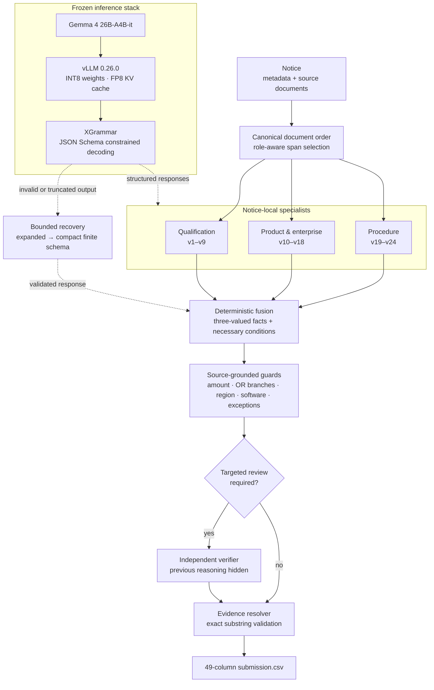

<div align="center">

# PPS Sentinel

### Evidence-grounded AI for public procurement compliance review

[](https://github.com/choi0312/public-procurement-compliance-ai/actions/workflows/contracts.yml)


공공 입찰 공고의 24개 규정 위반 가능성을 판정하고, 각 판단을 실제 원문 근거와 연결하는 추론 시스템입니다.

공공 입찰 공고 법령 위반 모니터링 AI 경진대회를 위해 개발한 모델입니다.

**주최** 행정안전부 · 한국지능정보사회진흥원<br>
**주관** 국립과학수사연구원

[Architecture](#architecture) · [Method](#method) · [Evaluation](#evaluation) · [Quick start](#quick-start) · [Research](#research-foundations)

</div>

---

## Overview

PPS Sentinel은 고정된 `google/gemma-4-26B-A4B-it`을 구조화 사실 추출기로 사용하고, 검토된 규칙과 원문 검증기를 결합해 공고별 24개 이진 판정과 근거를 생성합니다.

모델을 추가 학습하거나 파인튜닝하지 않습니다. 성능 개선은 **업무별 문제 분해**, **구조 제약 추론**, **결정적 규칙 결합**, **선택적 독립 검증**, **실패 복구**에 집중했습니다.

| | |
|---|---|
| **Task** | 공공 입찰 공고의 24개 규정 위반 가능성 분류 |
| **Backbone** | Gemma 4 26B-A4B-it, 고정 revision |
| **Learning** | 추가 학습·파인튜닝·adapter 없음 |
| **Inference** | 공고별 3개 specialist + 조건부 verifier |
| **Grounding** | 500자 이하의 실제 원문 부분문자열 |
| **Output** | `id + v1…v24 + e1…e24` 형식의 49열 CSV |
| **Runtime** | vLLM 0.26.0 · XGrammar · offline inference |

### Highlights

- **Domain specialists** — 자격, 제품, 절차를 서로 다른 문맥과 schema로 분석합니다.
- **Neuro-symbolic fusion** — LLM의 언어 이해와 사람이 검토한 금액·날짜·자격 규칙을 결합합니다.
- **Evidence by construction** — 생성된 설명 대신 현재 공고에 실제 존재하는 인용만 결과로 인정합니다.
- **Conservative abstention** — 문서가 불완전하거나 조건이 모호하면 규칙이 임의로 판정을 덮어쓰지 않습니다.
- **Bounded recovery** — 불완전한 응답은 라벨로 사용하지 않고 제한된 schema로 다시 판정합니다.

## Architecture



Gemma 4의 가중치나 내부 구조는 변경하지 않습니다. 이 프로젝트의 기여는 모델 바깥의 **입력 구성, 역할 분해, 출력 계약, 규칙 실행, 근거 검증**에 있습니다.

## Method

### 1. Notice-local context construction

한 공고의 문서를 원문 수정 없이 정렬하고, 자격·제품·절차별로 관련 구간을 선택합니다. 모든 span은 원래 문서 좌표와 `s001` 형식의 source ID를 유지합니다.

### 2. Specialist inference

동일한 고정 모델을 세 가지 역할로 실행합니다.

| Specialist | Labels | Focus |
|---|---:|---|
| Qualification | v1–v9 | 참가 주체, 사전 보유 요건, 실적·인력·시설, 지역 제한 |
| Product | v10–v18 | 실제 구매대상, 직접생산, 기업 규모, 경쟁제품 조건 |
| Procedure | v19–v24 | 확약 시점, 공동수급, 설명회, SW 문구, 원문–metadata 일치 |

각 pass는 `temperature=0`, `native_thinking=false`, 고정 JSON Schema로 실행됩니다. 다른 공고의 예측이나 통계는 현재 판정에 사용하지 않습니다.

### 3. Deterministic rule fusion

모델이 추출한 사실을 `yes / no / unknown`과 제한된 범주형 값으로 정규화합니다. 금액 구간, 날짜, OR 자격, 제품 조건처럼 기계적으로 검증 가능한 부분은 사전 작성한 Python 함수가 처리합니다.

`unknown`은 음성이 아닙니다. 필요조건을 확인할 수 없는 경우에는 기존 모델 판정을 유지해 불완전한 문서에서의 과도한 보정을 막습니다.

### 4. Targeted independent verification

오류가 잦은 v1·v9·v19의 양성만 고정 정책으로 선택해 다시 검토합니다. verifier에는 이전 label과 reasoning을 보여주지 않고, 현재 원문에서 주체·의무·시점·예외를 새로 확인하게 합니다.

제품군의 기업 범위가 불확실한 경우에는 직접생산, 영리기업 규모, 비영리 참가 예외만 별도 추출합니다. 새 범주와 그 응답의 자체 인용이 모순되면 변경을 거부합니다.

### 5. Evidence validation and recovery

최종 근거는 한 원문 문서에 문자 그대로 존재해야 합니다. 길이, CSV 안전성, 항목별 근거 허용 여부까지 검사합니다.

응답이 잘렸거나 schema 검증에 실패하면 다음 순서로만 복구합니다.

1. 남은 context 안에서 출력 예산 확대
2. reason을 제거한 compact `v/e` schema
3. 현재 공고의 source ID와 `null`만 허용하는 finite schema

부분 JSON을 보완하거나 이전 예측으로 대체하지 않습니다.

## Research foundations

| Reference | Principle | Adaptation in PPS Sentinel |
|---|---|---|
| [Decomposed Prompting](https://arxiv.org/abs/2210.02406), [Least-to-Most](https://arxiv.org/abs/2205.10625) | 복잡한 문제의 단계적 분해 | 임의 하위 질문 대신 24개 항목을 자격·제품·절차의 고정 specialist로 분할 |
| [Explainable Rule Application](https://arxiv.org/abs/2506.16335), [Structured Decomposition](https://arxiv.org/abs/2601.01609) | 사실 추출과 symbolic rule application 분리 | LLM은 공고 사실을 추출하고, 결정적 Python 규칙이 필요조건과 예외를 검증 |
| [PAL](https://arxiv.org/abs/2211.10435), [Program of Thoughts](https://arxiv.org/abs/2211.12588) | 언어 이해와 계산의 분리 | 생성 코드를 실행하지 않고 금액·날짜·분기 계산을 검토된 함수로 제한 |
| [Chain-of-Verification](https://arxiv.org/abs/2309.11495), [Self-verification limits](https://proceedings.iclr.cc/paper_files/paper/2025/hash/f3c5e56274140e0420baa3916c529210-Abstract-Conference.html) | 초안과 검증의 분리, 자기비평의 한계 | 모든 출력을 반복 수정하지 않고 사전 선택한 양성 항목만 독립 검증 |
| [Lost in the Middle](https://aclanthology.org/2024.tacl-1.9/) | 긴 문맥에서 위치에 따른 정보 손실 | specialist별 span 선택과 문서 순서 정규화; 무조건적인 문맥 확대는 제외 |
| [Law reasoning with evidence](https://aclanthology.org/2025.findings-acl.887/), [Korean Canonical Legal Benchmark](https://aclanthology.org/2026.eacl-short.17/) | 결론과 supporting evidence 연결 | 각 양성 판정을 현재 공고의 검증 가능한 원문 substring에 연결 |
| [De Jure](https://arxiv.org/abs/2604.02276) | 구조화 규칙 추출과 bounded repair | 반복 LLM judge 대신 기계적 schema 검증 실패에만 제한 복구 적용 |

2026년 Structured Decomposition과 De Jure는 구현 완료 후 확인한 최신 근접 연구로, 방법론적 위치를 설명하기 위한 비교 대상입니다. 해당 연구의 데이터·가중치·코드는 추론 파이프라인에 사용하지 않았습니다.

## Evaluation

최종 고정 코드로 공개 입력 1,853건을 실제 실행하고 출력 계약을 전수 검사했습니다.

| Metric | Result |
|---|---:|
| Public validation Macro F1 | **0.789962** |
| End-to-end workload | **1,853 notices** |
| Wall-clock time | **6,390.95 s** |
| Accepted model responses | **6,901** |
| Recovery attempts | **3 / 3 recovered** |
| Local validation suite | **289 passed** |
| CSV · source evidence · fusion audit | **PASS** |

공개 validation 200건은 반복 개발에 사용했으므로 독립 검증셋이 아닙니다. 순서 변경과 별도 실행에서 일부 label 변동도 관측되어 bitwise reproducibility나 비공개 성능을 이 수치로 주장하지 않습니다. 상세 ablation과 한계는 [Experiments](docs/EXPERIMENTS.md)에 기록했습니다.

## Quick start

### Requirements

```text
Python 3.12
vllm==0.26.0
torch==2.11.0+cu130
transformers==5.14.1
xgrammar==0.2.3
```

실측 환경은 NVIDIA L40S 48GB 1장입니다. 모델과 대회 제공 데이터는 저장소에 포함하지 않습니다.

### Configure paths

```bash
export PPS_DATA_DIR=/path/to/official/data
export PPS_OUTPUT_DIR=/path/to/output
export PPS_MODEL_DIR=/path/to/google-gemma-4-26B-A4B-it
```

### Validate contracts without a GPU

```bash
python scripts/test_submission_contract.py
python scripts/package_submission.py --output /tmp/submission.zip
PPS_AUDIT_ZIP=/tmp/submission.zip python scripts/test_submission_contract.py
```

### Mock pipeline

```bash
python submission/script.py \
  --mock \
  --limit 3 \
  --config submission/model/config.json \
  --output-dir /tmp/pps-mock
```

### Run inference

```bash
python submission/script.py \
  --config submission/model/config.json \
  --output-dir "$PPS_OUTPUT_DIR" \
  --save-details
```

## Repository layout

```text
.
├── submission/
│   ├── script.py                  # inference entry point and output contracts
│   ├── pps_specialists.py         # qualification / product / procedure passes
│   ├── pps_verifier.py            # targeted independent verification
│   ├── pps_recovery.py            # bounded response recovery
│   ├── pps_*_facts.py             # notice-local structured facts
│   ├── pps_*_rules.py             # deterministic rule layer
│   └── model/config.json           # frozen runtime configuration
├── scripts/
│   ├── package_submission.py
│   ├── test_submission_contract.py
│   ├── validate_packaged.py
│   └── evaluate.py
└── docs/
    ├── METHODOLOGY.md
    ├── EXPERIMENTS.md
    ├── IMPLEMENTATION_GUIDE.md
    └── REPRODUCIBILITY.md
```

## Documentation

- [Methodology](docs/METHODOLOGY.md) — 연구 아이디어와 대회 문제에 맞춘 확장
- [Experiments](docs/EXPERIMENTS.md) — ablation, 제외한 방법, 안정성 분석
- [Implementation guide](docs/IMPLEMENTATION_GUIDE.md) — 모듈 책임과 설정 해석
- [Reproducibility](docs/REPRODUCIBILITY.md) — 환경, 실행, 평가, ZIP 감사
- [Source provenance](submission/SOURCES.md) — 코드와 정적 자산의 출처

## Scope and limitations

- 입력은 한 공고씩 독립적으로 처리합니다.
- 외부 입찰·법령·라벨 데이터와 추론 중 외부 API를 사용하지 않습니다.
- BGE-M3는 제공된 제품 목록 검색 실험에서만 비교했고 최종 추론에서는 제외했습니다.
- 정규식 규칙은 명백한 조건만 처리하며 법률 해석 전체를 대체하지 않습니다.
- 저장소의 출력은 연구·경진대회용 분류 결과이며 실제 조달 업무의 법률 자문이 아닙니다.

## Reproducible release

`submission/`의 33개 배포 파일은 최종 고정 archive와 바이트 단위로 일치합니다.

```text
SHA-256  9aad773e648a521aa4ae2e52680ff2c847b27040c231f17f16984e99f4c84922
```

원본 데이터, 라벨, 모델 가중치, 모델 응답, API credential은 공개 저장소에서 제외했습니다.

## Core references

- Sadowski & Chudziak. [Explainable Rule Application via Structured Prompting](https://arxiv.org/abs/2506.16335), 2025.
- Sadowski & Chudziak. [Structured Decomposition for LLM Reasoning](https://arxiv.org/abs/2601.01609), 2026. [Code](https://github.com/albsadowski/structured-decomposition-swj)
- Shen et al. [A Law Reasoning Benchmark with Factum Probandum, Evidence and Experiences](https://aclanthology.org/2025.findings-acl.887/), ACL Findings 2025.
- Oh et al. [Korean Canonical Legal Benchmark](https://aclanthology.org/2026.eacl-short.17/), EACL 2026. [Code and data](https://github.com/lbox-kr/kcl)
- Stechly et al. [On the Self-Verification Limitations of Large Language Models](https://proceedings.iclr.cc/paper_files/paper/2025/hash/f3c5e56274140e0420baa3916c529210-Abstract-Conference.html), ICLR 2025.
- Google. [Gemma 4 model overview](https://ai.google.dev/gemma/docs/core)
- Kwon et al. [vLLM](https://arxiv.org/abs/2309.06180) and [vLLM 0.26 documentation](https://docs.vllm.ai/en/v0.26.0/)
- Dong et al. [XGrammar](https://arxiv.org/abs/2411.15100) and [v0.2.3 source](https://github.com/mlc-ai/xgrammar/tree/v0.2.3)
